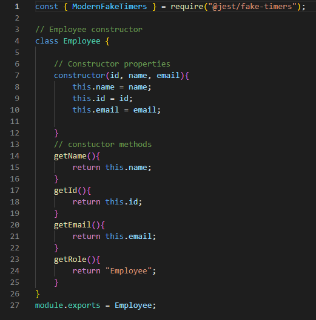
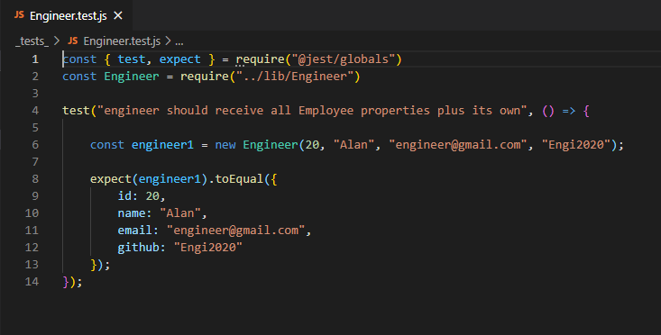
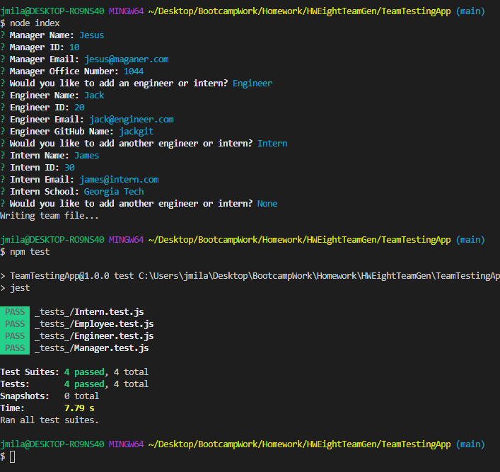
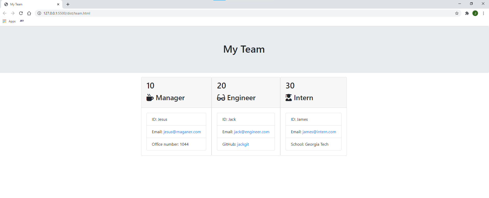

# TeamTestingApp

# What is the purpose of this application?
This application is used to create a HTML file that displays a work team roster composed of a manager, engineers and interns. You set up the team following a series of prompts on the command line which populates your completed team roster. The member have some properties that are click-able links such as emails and github profiles so you can get a deeper view of each team member.

## Tech used to complete this assigment
* HTML
* BOOTSTRAP
* JAVASCRIPT
* NPM
* JEST (for testing)
* NODE.JS
  
## Takeaways from this project
One of the sections for this project that I got stuck on for the most part was TESTING. Jest is an intuitive and fast library to use for this matter, however, it is the concept of actually writting out the tests that I can get more practice on. 

## Test?
This application can be tested using Jest

## Images of code

## Video Walkthrough
[Walkthrough:] https://drive.google.com/file/d/1MwXp4ipylM-vIC7sahgzCZMW_TQKs_W7/view

## Questions?
[GitHub:] https://github.com/Milan1422
[Email:] jmilan.gonzalez@gmail.com
